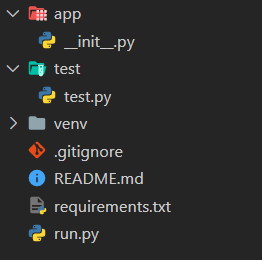

# Welcome to the Quike on Flask, REST API, Swagger UI, DB Connection
## Create the starter project like below folder structure

https://flask.palletsprojects.com/en/2.2.x/
https://flask-restx.readthedocs.io/en/latest/installation.html 