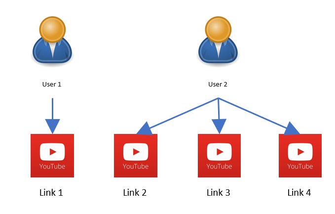

# Welcome to the Quickie on Flask, REST API, Swagger UI, DB Connection

## Run setup.bat file for windows
- Open cmd in repo folder
- Run `setup.bat`

## Starter App
- Open `starter_app` folder, run `app.py` file 

[starter_app/app.py](starter_app/app.py)

```python
# Importing flask modules to start with
from flask import Flask

# Creating new flask app
app = Flask(__name__)

# Creating a basic GET endpoint for
# Endpoint : http://localhost:5000/
@app.route('/')
def index():
    return {'data':'Hello World!'}

# Main code to start the server
if __name__ == "__main__":
    app.run(host='localhost', port=5000, debug=True)
```

## Simple Rest API App
- Open `simple_restapi_app` folder, run `app.py` file 

[simple_restapi_app/app.py](simple_restapi_app/app.py)

```python
# Importing requried modules
from flask import Flask, jsonify, request
from datetime import datetime
import urllib.request

# Creating new flask app
app = Flask(__name__)

# Creating empty linky dict for store the links
linky = {}

# Creating 2 check which will validate and verify the data
def checkLink(link, error):
    try:
        if not str(urllib.request.urlopen(link).getcode()).startswith('20'):
            error.append("ERROR: Link given is not valid")    
    except Exception as e:
        error.append("ERROR: Link given is not valid")
    return error

def checkId(id, error):
    if id not in linky:
        error.append("ERROR: Link ID given is not valid")
    return error

# Let's start with our CRUD app logic

# Create operation CRUD, ie : C -> CRUD
# Endpoint : http://localhost:5000/createlink  
# To create a new link dict and add that to our linky dict
@app.route('/createlink', methods=['POST'])
def createlink():
    data = request.get_json()
    error = []
    id = str(round(datetime.now().timestamp()))
    link = data['link']
    error = checkLink(link=link, error=error)
    if len(error) == 0:
        linky[id] = {'id' : id, 'link' : link}
        return jsonify({'data' : 'link added with id {}'.format(id), 'error' : []}), 200
    else:
        return jsonify({'data' : [], 'error' : error}), 404

# Read operation CRUD, ie : R -> CRUD
# Endpoint : http://localhost:5000/readlink (or) http://localhost:5000/
# To read & return all links in linky dict
@app.route('/', methods=['GET'])
@app.route('/readlink', methods=['GET'])
def readlink():
    return jsonify({'data' : linky, 'error' : []}), 200

# Update operation CRUD, ie : U -> CRUD
# Endpoint : http://localhost:5000/updatelink 
# To update a link in linky dict using link's id
@app.route('/updatelink', methods=['PUT'])
def updatelink():
    data = request.get_json()
    error = []
    id = data['id']
    link = data['link']

    error = checkId(id, error)
    error = checkLink(link, error)

    if len(error) == 0:
        linky[id] = {'id' : id, 'link' : link}
        return jsonify({'data' : 'link updated on id {}'.format(id), 'error' : []}), 200
    else:
        return jsonify({'data' : [], 'error' : error}), 404

# Delete operation CRUD, ie : D -> CRUD
# Endpoint : http://localhost:5000/deletelink 
# To delete a link in linky dict using link's id
@app.route('/deletelink', methods=['DELETE'])
def deletelink():
    data = request.get_json()
    error = []
    id = data['id']

    error = checkId(id, error)

    if len(error) == 0:
        del linky[data['id']]
        return jsonify({'data' : 'link with id {} deleted'.format(data['id']), 'error' : []}), 200
    else:
        return jsonify({'data' : [], 'error' : error}), 404

# Main template code to start the server
if __name__ == "__main__":
    app.run(host='localhost', port=5000, debug=True)
```

## Let's start db connection
- Open `db_connection_app` folder, run `app.py` file 
- Sqlite database connection with `flask_sqlalchemy` 

[`db_connection_app/app.py`](db_connection_app/app.py)
```python
from flask_sqlalchemy import SQLAlchemy

...

# create the extension
db = SQLAlchemy()

...

# configure the SQLite database, relative to the app instance folder
db_path = os.path.join(os.getcwd(), 'db_connection_app/linky.db')
app.config["SQLALCHEMY_DATABASE_URI"] = "sqlite:///" + str(db_path)
# initialize the app with the extension
db.init_app(app)

```
- Simple model created for link

[`db_connection_app/app.py`](db_connection_app/app.py)
```python
class Link(db.Model):
    # To find all the datatypes can used for columns can find by printing below link 
    # print(dir(db.types))

    # Column args, autoincrement, default, nullable, primary_key, unique, quote (to force quote), comment
    id = db.Column(db.Integer, primary_key=True)
    link = db.Column(db.String(200), nullable=False)
    title = db.Column(db.String(50), nullable=False)
    created = db.Column(db.DateTime(), default=datetime.now())
    updated = db.Column(db.DateTime())

    # Add current obj of link to db
    def add(self):
        db.session.add(self)
        db.session.commit()

    # Update current obj of link to db
    def update(self):
        self.updated = datetime.now()
        db.session.commit()

    # Delete current obj of link from db
    def delete(self):
        db.session.delete(self)
        db.session.commit()
    
    def json(self):
        return {
            "id" : self.id,
            "title" : self.title,
            "link" : self.link,
        }

    def __repr__(self):
        return 'Link(id={}, link={}, title={})'.format(self.id, self.link, self.title)

# To create db & table if not exsist
with app.app_context():
    db.create_all()
```
- Route which invoke these model

[`db_connection_app/app.py`](db_connection_app/app.py)
```python

@app.route('/createlink', methods=['POST'])
def createlink():
    ...
    try:
        link = Link(id=id, title=title, link=link, created=datetime.now(), updated=datetime.now())
        link.add()
    except Exception as err:
        if "UNIQUE constraint failed: link.link" in str(err):
            error.append("ERROR : Link given is already added to our database")
        else:
            error.append(str(err))
    ...

@app.route('/', methods=['GET'])
@app.route('/readlink', methods=['GET'])
def readlink():
    ...
    try:
        links = Link.query.all() # we get as model obj
        linky = [l.json() for l in links] # running new loop for change obj to json :(, but we can find solution for this in upcoming modules
    except Exception as err:
        error.append(str(err))
    ...

@app.route('/<int:id>', methods=['GET'])
@app.route('/readlink/<int:id>', methods=['GET'])
def readSinglelink(id):
    ...
    try:
        link = Link.query.filter(Link.id == id).first()
        linky.append(link.json())
    except Exception as err:
        if "'NoneType' object has no attribute" in str(err):
            error.append("ERROR : There is not link created with id {}".format(id))
        else:
            error.append(str(err))
    ...

@app.route('/updatelink', methods=['PUT'])
def updatelink():
    ...
    try:
        link = Link.query.filter(Link.id == id).first()
        if new_link:
            error = checkLink(new_link, error)
            link.link = new_link
        if new_title:
            link.title = new_title
        link.update()
    except Exception as err:
        if "'NoneType' object has no attribute" in str(err):
            error.append("ERROR : There is not link created with id {}".format(id))
        else:
            error.append(str(err))
    ...

@app.route('/deletelink', methods=['DELETE'])
def deletelink():
    ...
    try:
        link = Link.query.filter(Link.id  == id).first()
        link.delete()
    except Exception as err:
        if "'NoneType' object has no attribute" in str(err):
            error.append("ERROR : There is not link created with id {}".format(id))
        else:
            error.append(str(err))
    ...
```

## One to Many Relationship on DB
- As you can see we are handleing lot of code in single file, it time to jump into modules
- Explore `project` module in `one_to_many_relationship_db_app` folder
- run `main.py` file, to start the server
- let's stick to the 1:n relationship

[one_to_many_relationship_db_app/project/models.py](one_to_many_relationship_db_app/project/models.py)
```python
class User(db.Model):
    ...
    ...
    links = db.relationship('Link', backref='user_obj')
    ...
    ...

class Link(db.Model):
    ...
    ...
    user_id = db.Column(db.Integer, db.ForeignKey('user.id'), nullable=False)
    ...
    ...
```
- above two link make one to many relationship between those to table User (1) -> Link(n)



- use of Flask SQL-Alchemy ?
- no need to write complex query to make or use this relationship

[one_to_many_relationship_db_app/project/routes.py](one_to_many_relationship_db_app/project/routes.py)
```python
@app.route('/createlink', methods=['POST'])
def createlink():
    ...
    try:
        user = User.query.filter(User.id == user_id).first()
        link = Link(id=id, title=title, link=link, created=datetime.now(), updated=datetime.now(), user_obj=user)
        link.add()
    except Exception as err:
        if "NOT NULL constraint failed: link.user_id" in str(err):
            error.append("ERROR : Please provide valid 'user_id' while creating link")
        else:
            error.append(str(err))
    ...
```
## Reference link
- [Flask Documentation](https://flask.palletsprojects.com/en/2.2.x/)
- [Flask SQL-Alchemy](https://flask-sqlalchemy.palletsprojects.com/en/3.0.x/)
- [RestX Documentation](https://flask-restx.readthedocs.io/en/latest/installation.html)
